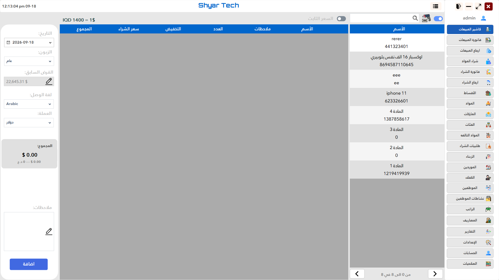
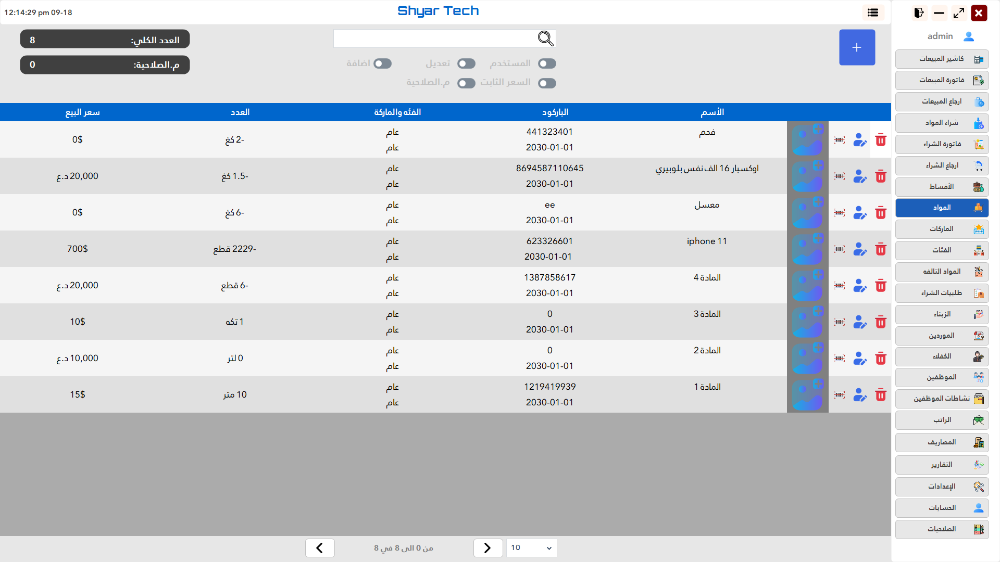
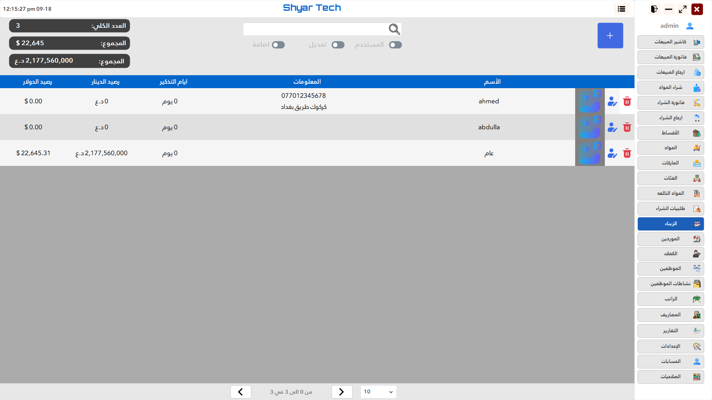
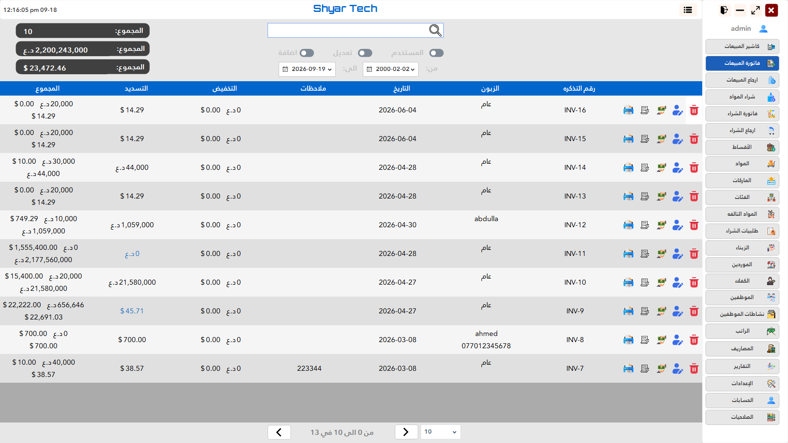
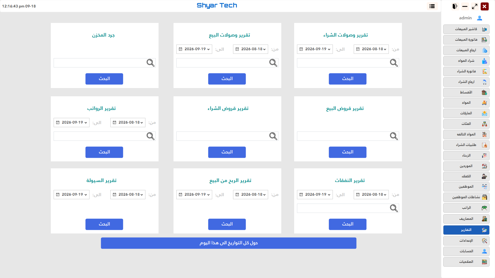

# ShyarTech POS

A desktop Point of Sale system developed with Windows Forms for managing retail sales and inventory.

ShyarTech POS was one of my earlier desktop applications and helped me gain practical experience in C#, database programming, business logic, and POS workflows.

## Screenshots


### POS / Sales Screen



### Products



### Customers



### Sales History



### Reports



## Features

* Point of Sale
* Product management
* Inventory management
* Customer management
* Sales management
* Sales history
* Invoice generation
* Database-backed data management
* Business reports
* Desktop-based workflow

## Technology Stack

* C#
* .NET
* Windows Forms
* SQL Server

## Application Architecture

The application separates the user interface, business logic, and data-access responsibilities.

```text
Windows Forms UI
       │
       ▼
Business Logic
       │
       ▼
Data Access
       │
       ▼
SQL Server
```

## What I Learned

This project gave me practical experience with:

* C# desktop development
* Windows Forms
* Object-oriented programming
* SQL databases
* CRUD operations
* Business logic
* POS workflows
* Database-driven applications
* Designing software for real business requirements

## Project Status

Completed legacy project.

## ✍️ Author
Ealam Dhahir Taher
- GitHub: https://github.com/EaloTaher
- LinkedIn: https://www.linkedin.com/in/ealam-taher
- Email: ealamtaher4@gmail.com
